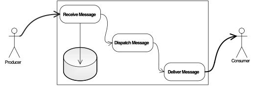

# 典型实现

 一个典型的消息中间件实现一般分为以下几部分：

1. 消息接收阶段，收到消息后，存储到存储模块，可以是本地KV存储、文件记录存储、远程DB、或其他存储模式，然后将消息转发至Dispatch处理流程。
2. 消息分发阶段，可能的操作包含消息过滤、分发到特定队列或者Consumer Group队列。
3. 消息投递阶段，直接与Consumer进行通信，可以是主动投递或者被动投递。

